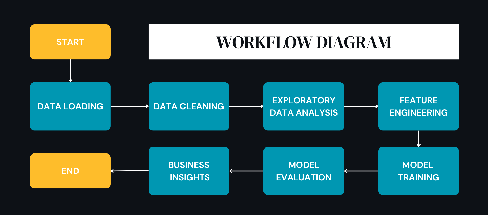

# Linear Regression: E-Commerce Customer Spending Analysis

## Project Overview
This project analyzes customer behavior to determine whether an **E-commerce company** should focus on **improving their mobile app or website** to increase revenue.

We implemented **Linear Regression from scratch** using **Gradient Descent** to predict `Yearly Amount Spent`. The goal was to provide **data-driven business recommendations** based on customer engagement metrics.

## Key Findings
- **Time on App** has a **strong positive impact on spending**.
- **Website engagement does not significantly influence revenue**.
- **Length of Membership is the biggest driver of spending** → Suggests implementing a **loyalty program**.

## Workflow Diagram
  

## How to Run the Project
### **Clone the Repository**
```bash
git clone https://github.com/eshitakundu/ecommerce-linear-regression.git
cd ecommerce-linear-regression
```

### **Install Dependencies**
```bash
pip install -r requirements.txt
```

### **Run the Jupyter Notebook**
Open `Ecommerce_Linear_Regression.ipynb` in Jupyter Notebook and run the cells step by step.

## Model Performance
| **Metric** | **Value** |
|------------|----------|
| **Mean Squared Error (MSE)** | `109.83` |
| **Root Mean Squared Error (RMSE)** | `10.48` |
| **R² Score** | `0.9778` |

## Feature Importance & Business Impact
| Feature | Weight (Theta) | Business Impact |
|---------|--------------|----------------|
| **Bias (Intercept)** | `~501.97` | Baseline spending before considering features |
| **Avg. Session Length** | `~25.25` | Small impact on spending |
| **Time on App** | `~38.70` | Strong impact, more app usage = more spending |
| **Time on Website** | `~3.15` | Weak impact, website engagement does not drive revenue much |
| **Length of Membership** | `~63.54` | **Biggest driver**, loyal customers spend the most |

## Business Recommendations
- **Invest in Mobile App Improvements** → Enhancing the app UI/UX and introducing new features may lead to **higher spending**.
- **Avoid heavy website investment** → Since `Time on Website` has a **low impact**, focusing on the app is a better strategy.
- **Implement a Customer Loyalty Program** → Since long-term members spend the most, offering **exclusive discounts or rewards** could further increase revenue.

## 📜 Licensing & Acknowledgments
- **Dataset Source:** [Kaggle](https://www.kaggle.com/datasets/iyadavvaibhav/ecommerce-customer-device-usage)    

---

**Check out the full project notebook for implementation details.**